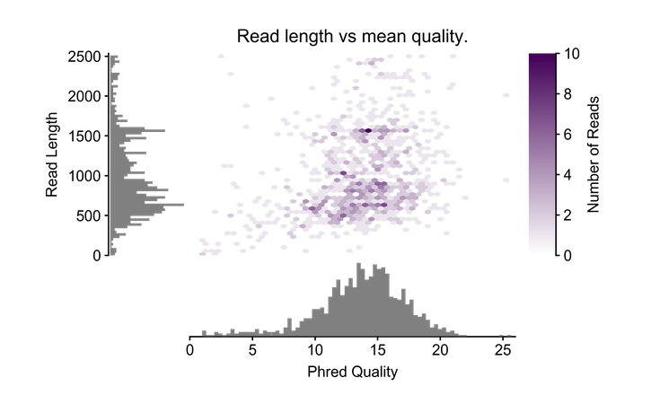
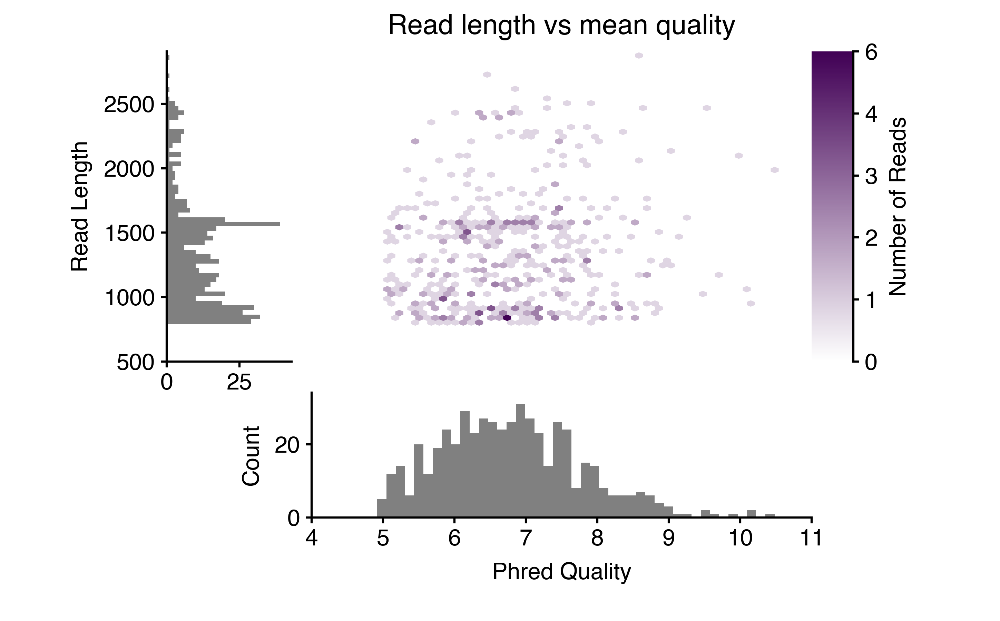

## pauvre: a plotting package designed for nanopore and PacBio long reads

This package currently hosts four scripts for plotting and/or printing stats.

- `pauvre marginplot`
  - takes a fastq file as input and outputs a marginal histogram with a heatmap.
- `pauvre stats`
  - Takes a fastq file as input and prints out a table of stats, including how many basepairs/reads there are for a length/mean quality cutoff.
  - This is also automagically called when using `pauvre marginplot`
- `pauvre redwood`
  - I am happy to introduce the redwood plot to the world as a method
    of representing circular genomes. A redwood plot contains long
    reads as "rings" on the inside, a gene annotation
    "cambrium/phloem", and a RNAseq "bark". The input is `.bam` files
    for the long reads and RNAseq data, and a `.gff` file for the
    annotation. More details to follow as we document this program
    better...
- `pauvre synteny`
  - Makes a synteny plot of circular genomes. Finds the most
    parsimonius rotation to display the synteny of all the input
    genomes with the fewest crossings-over. Input is one `.gff` file
    per circular genome and one directory of gene alignments.

## Updates:
- 20171130 - v0.1.86 - some changes by @wdecoster to integrate `pauvre` into [nanoplot](https://github.com/wdecoster/NanoPlot), 
  as well as some formatting changes that *may* make `pauvre` work better with python2.7. Adding Travis-CI functionality.
- 20171025 - v0.1.83 - added some changes to make marginplot interface
  with @wdecoster's [nanoPlot](https://github.com/wdecoster/NanoPlot)
  package, and made `pauvre stats` only output data tables for
  filtered reads. `pauvre stats` also now has the `--filt_maxlen`,
  `--filt_maxqual`, `--filt_minlen`, and `--filt_minqual` options.
- 20171018 - v0.1.8 - you can now filter reads and adjust the plotting viewing window. 
  [See below for a demonstration.](#filter-reads-and-adjust-viewing-window) I added the following options:

```
  --filt_maxlen FILT_MAXLEN
                        This sets the max read length filter reads.
  --filt_maxqual FILT_MAXQUAL
                        This sets the max mean read quality to filter reads.
  --filt_minlen FILT_MINLEN
                        This sets the min read length to filter reads.
  --filt_minqual FILT_MINQUAL
                        This sets the min mean read quality to filter reads.
  --plot_maxlen PLOT_MAXLEN
                        Sets the maximum viewing area in the length dimension.
  --plot_maxqual PLOT_MAXQUAL
                        Sets the maximum viewing area in the quality
                        dimension.
  --plot_minlen PLOT_MINLEN
                        Sets the minimum viewing area in the length dimension.
  --plot_minqual PLOT_MINQUAL
                        Sets the minimum viewing area in the quality
                        dimension.
```
- 20171014 - uploading information on `pauvre redwood` and `pauvre synteny` usage.
- 20171012 - made `pauvre stats` more consistently produce useful histograms.
  `pauvre stats` now also calculates some statistics for different size ranges.
- 20170529 - added automatic scaling to the input fastq file. It
  scales to show the highest read quality and the top 99th percentile
  of reads by length.

# Requirements

- You must have the following installed on your system to install this software:
  - python 3.x
  - matplotlib
  - biopython
  - pandas
  - pillow

# Installation

- Instructions to install on your mac or linux system. Not sure on
  Windows! Make sure *python 3* is the active environment before
  installing.
  - `git clone https://github.com/conchoecia/pauvre.git`
  - `cd ./pauvre`
  - `pip3 install .`
- Or, install with pip
  - `pip3 install pauvre`

# Usage

## `stats`
  - generate basic statistics about the fastq file. For example, if I
    want to know the number of bases and reads with AT LEAST a PHRED
    score of 5 and AT LEAST a read length of 500, run the program as below 
    and look at the cells highlighted with `<braces>`.
    - `pauvre stats --fastq miniDSMN15.fastq`


```
numReads: 1000
numBasepairs: 1029114
meanLen: 1029.114
medianLen: 875.5
minLen: 11
maxLen: 5337
N50: 1278
L50: 296

                      Basepairs >= bin by mean PHRED and length
minLen       Q0       Q5     Q10     Q15   Q17.5    Q20  Q21.5   Q25  Q25.5  Q30
     0  1029114  1010681  935366  429279  143948  25139   3668  2938   2000    0
   500   984212  <968653> 904787  421307  142003  24417   3668  2938   2000    0
  1000   659842   649319  616788  300948  103122  17251   2000  2000   2000    0
 et cetera...
              Number of reads >= bin by mean Phred+Len
minLen    Q0   Q5  Q10  Q15  Q17.5  Q20  Q21.5  Q25  Q25.5  Q30
     0  1000  969  865  366    118   22      3    2      1    0
   500   873 <859> 789  347    113   20      3    2      1    0
  1000   424  418  396  187     62   11      1    1      1    0
 et cetera...
```

##  `marginplot`

### Basic usage
- automatically calls `pauvre stats` for each fastq file
- Make the default plot showing the 99th percentile of longest reads
  - `pauvre marginplot --fastq miniDSMN15.fastq`
  - 
- Make a marginal histogram for ONT 2D or 1D^2 cDNA data with a
  lower maxlen and higher maxqual.
  - `pauvre marginplot --maxlen 4000 --maxqual 25 --lengthbin 50 --fileform pdf png --qualbin 0.5 --fastq miniDSMN15.fastq`
  - 

### Filter reads and adjust viewing window
- Filter out reads with a mean quality less than 5, and a length
  less than 800. Zoom in to plot only mean quality of at least 4 and
  read length at least 500bp.
  - `pauvre marginplot -f miniDSMN15.fastq --filt_minqual 5 --filt_minlen 800 -y --plot_minlen 500 --plot_minqual 4`
  - 

### Specialized Options

- Plot ONT 1D data with a large tail
  - `pauvre marginplot --maxlen 100000 --maxqual 15 --lengthbin 500  <myfile>.fastq`
- Get more resolution on lengths
  - `pauvre marginplot --maxlen 100000 --lengthbin 5  <myfile>.fastq`

### Transparency

- Turn off transparency if you just want a white background
  - `pauvre marginplot --transparent False <myfile>.fastq`
  - Note: transparency is the default behavior
    - 

# Contributors

@conchoecia (Darrin Schultz)
@mebbert (Mark Ebbert)
@wdecoster (Wouter De Coster)
